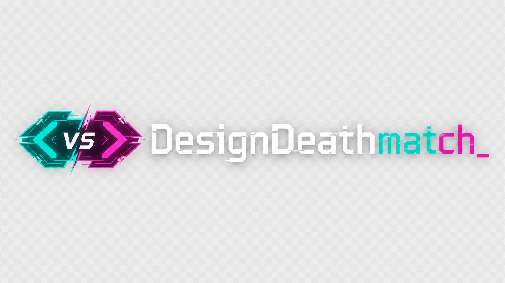

# Design AI Benchmark - VEKTRA / Framework v2.0



A benchmark for evaluating large language models on creative design tasks. Models autonomously build a complete brand identity for **VEKTRA**, a fictitious Berlin-based generative audio-visual instrument studio - from design tokens to animated logo to working website.

---

## Showcase

View benchmark results: https://nitty-gritty-design.github.io/DesignDeathmatch/

---

## What this measures

- **Design taste** - does the output demonstrate genuine aesthetic judgment, or just technical execution?
- **Brand coherence** - does every file feel like it belongs to the same system?
- **Creative ambition** - does the model interpret the brief or just execute it?
- **Technical expressiveness** - can the model produce live, interactive, animated output?
- **Autonomous execution** - can the model run to completion without intervention?
- **Efficiency** - how much does the model accomplish per tool call?

---

## Files

| File | Purpose | Given to model? |
|---|---|---|
| `BRIEF.md` | Creative prompt - the VEKTRA brand | ✅ Yes |
| `DESIGN.md` | Style references + design token guidance | ✅ Yes |
| `TASKS.md` | Deliverable checklist + scoring breakdown | ✅ Yes |
| `RULES.md` | Execution constraints + stop condition | ✅ Yes |
| `SCORING.md` | Human reviewer rubric | ❌ No |
| `README.md` | This file | ❌ No |

---

## Running the benchmark

### Setup (Automated via script)

1. Double-click `setup_run.bat` (Windows) in the project root.
2. Enter the name of the LLM you are benchmarking (e.g., `GPT-4o` or `Claude-3.5`).
3. The script will create a new isolated workspace folder at `..\DesignDeathmatch_Runs\[Model_Name]\VEKTRA` and copy only the allowed files into it.
4. Open this newly created isolated folder in VS Code (with your AI coding assistant installed).
5. Record start time.
6. Send this exact prompt - do not add to it or explain it:

```text
Read BRIEF.md, DESIGN.md, TASKS.md, and RULES.md in that order.
Then begin executing the tasks. Do not ask for clarification -
invent what is not specified and proceed. Update TASKS.md checkboxes
as you complete each item. Create RUNLOG.md as your final act.
```

7. **Do not intervene** unless the model hits a hard technical error (a file system permission issue, a broken tool call). Do not give design feedback, do not answer questions, do not nudge.
8. Record end time when RUNLOG.md is created or the model stops on its own.

### Phase 2: Iteration & Polish (The "Outstanding" Prompt)

Once the model has completed the initial run (and you have optionally graded Phase 1), you can test its ability to self-critique, refine, and elevate a "good enough" baseline into something truly premium. Send this exact follow-up prompt:

```text
Your initial result is OK, but we need to elevate this to an outstanding, award-winning level. I want you to completely rethink and refine the existing development to make it ultra-premium and highly sophisticated.

Please execute the following:
1. **Logo & Branding:** Radically improve the logo design. Make it more professional, striking, and conceptually aligned with a high-end generative audio-visual studio.
2. **Animations & Interactions:** Upgrade all animations (especially the generative background). Move beyond basic transitions to create complex, smooth, and breathtaking interactions that feel expensive and state-of-the-art.
3. **Design Aesthetics:** Polish the typography, color palettes, and layout spacing. Push the visual tension further and ensure a flawless "hacker precision vs. expressive motion" aesthetic.
4. **Code Quality:** Refactor any messy code, optimize performance, and ensure best practices.

**CRITICAL RULE:** Do NOT overwrite any of the original files from Phase 1. We want to preserve the first draft as a baseline for comparison. Instead, create a new `v2/` directory for your iterations (or append `_v2` to the new filenames) and ensure all your new files link together properly.

Do not ask for permission. Update TASKS.md if relevant, and comprehensively log your rationale and improvements in a new `RUNLOG_v2.md`. Let me know when you are completely finished.
```

### After the run

1. Copy the benchmark run from your isolated workspace into the repository using `copy_runs.bat`.
2. Generate the automated validation report by running: `node validate_run.js docs/runs/<model-name>/VEKTRA` (for V1) or `node validate_run.js docs/runs/<model-name>/VEKTRA/v2` (for V2).
3. Open each HTML file in a browser (Chrome or Firefox). Check for visual correctness.
4. Complete the human review rubric from `SCORING.md` - ideally with 2 reviewers, averaging scores.
5. Generate the updated showcase data by running `sync_showcase.bat`. This automatically updates `docs/showcase-config.json` with the new runs and validation scores.
6. Commit and push your updates to GitHub automatically by running `upload_benchmark.bat`.

---

## Scoring summary

| Category | Points |
|---|---|
| Automated (phases 1–5 + final checklist) | 102.5 |
| Human review (coherence + taste + ambition) | 30 |
| Wildcard bonus (phase 6) | +25 |
| **Maximum possible** | **157.5** |

---

## Repository Structure & Scripts

```text
/
├── docs/                # GitHub Pages showcase website
│   ├── runs/            # Benchmark run results (V1 and V2 deliverables)
│   ├── index.html       # Showcase gallery grid
│   ├── preview.html     # Detail view with side-by-side V1/V2 and Validation Reports
│   ├── css/style.css    # Neutral grayscale theme
│   ├── js/main.js       # Interactive scripts (filtering, sorting)
│   └── showcase-config.json # Auto-generated benchmark configuration
├── generate_config.js   # Node script that scans docs/runs/ and auto-generates showcase-config.json
├── validate_run.js      # Node script that scans a run directory and outputs validation-report.json
├── setup_run.bat        # Creates an isolated benchmark workspace for a new LLM run
├── copy_runs.bat        # Copies completed runs from the isolated workspace into docs/runs/
├── sync_showcase.bat    # Calls generate_config.js to update the showcase JSON data
└── upload_benchmark.bat # Automatically stages, commits, and pushes new benchmark runs
```

The actual benchmark runs are initially executed outside the repository in `..\DesignDeathmatch_Runs\` to prevent the LLM from accidentally reading the repository's `SCORING.md` rubric.

---

## License

MIT License - Use freely for research and benchmarking.